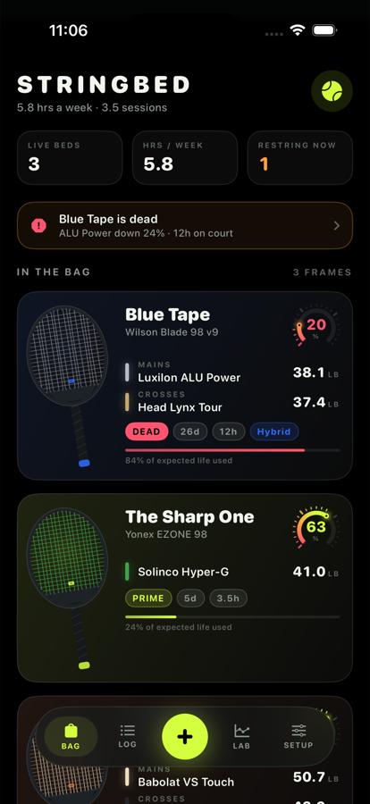
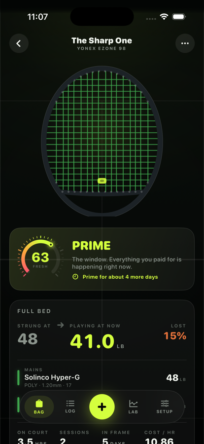
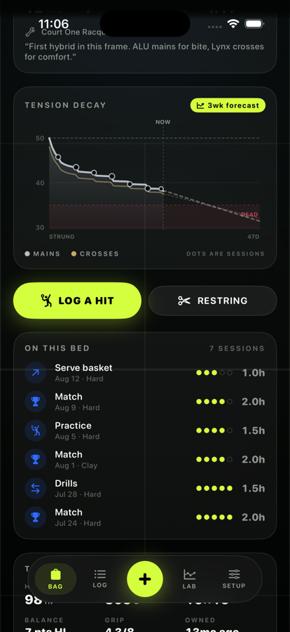
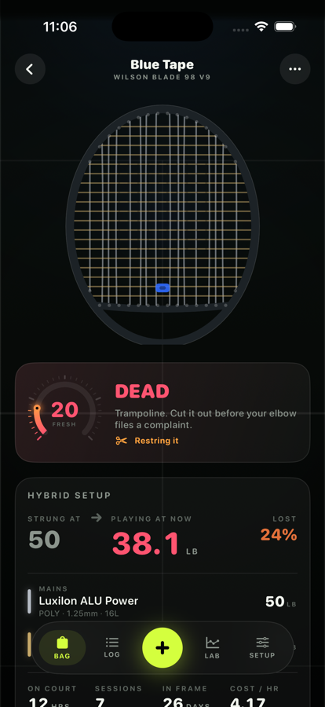
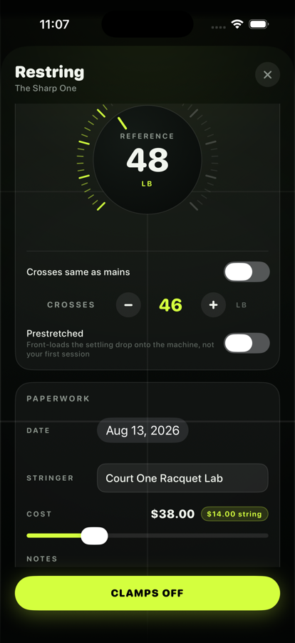
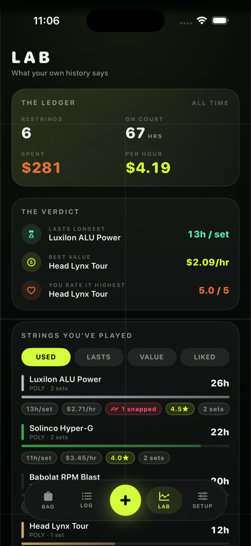

# Stringbed

An iOS app for people who can feel when a stringbed has gone, but can never remember
what they strung it at.

Track the frames in your bag, every stringing that goes into them, and every hour you
put on them — then get a straight answer to the only question that matters: *is this
bed still worth playing?*

<p align="center">
  
  
  
</p>

## The idea

Every other racket tracker is a spreadsheet with a date field. This one models what
actually happens to a stringbed: it settles, it creeps, it takes a beating every hour
you play, and somewhere in there it stops doing the thing you paid for.

**The frame is the interface.** Every racket is drawn as an actual stringbed on a
`Canvas` — its real pattern (16×19, 18×20), its real string colours, mains and crosses
separately for hybrids. Open a racket and it strings itself in front of you: mains
first from the centre pair outwards, then crosses top down, the order it happens on a
machine. As a bed ages the mains drift out of line, the crossings notch, and the whole
plane loses its snap. You can tell a dead frame from a fresh one across the room.

<p align="center">
  
  
  
</p>

## What it does

- **The bag** — every frame with its live stringbed, a freshness gauge, current
  estimated tension, and how much of the set's expected life you've burned.
- **Restring** — record a stringing with a knurled tension dial that detents every half
  pound. Full bed or hybrid, prestretched or not, who strung it and what it cost. The
  outgoing set gets retired with a reason, which is what feeds the stats later.
- **Log a hit** — court time against whatever is in the frame, with the kind of session
  and the surface, because a basket of serves on clay is not a lesson indoors. It shows
  you what the session will do to the tension *before* you commit it.
- **Tension decay** — the whole life of a stringing as a curve, with your sessions
  marked on it, the dead zone shaded, and a forecast at your current play rate.
- **The Lab** — which of your strings lasts longest, which is cheapest per hour, which
  one you actually rated highest, and whether you're riding your beds past the old
  stringer's rule (restring as many times a year as you play per week).
- Twelve real strings preloaded, a demo bag on first launch, and pounds or kilos.

## How the tension model works

Tension loss is three independent multiplicative effects, with constants per material
(`Stringbed/Model/StringSpec.swift`) and the maths in
[`TensionEngine`](Stringbed/Model/TensionEngine.swift):

| Effect | Shape | Notes |
| --- | --- | --- |
| **Settling** | `settleLoss · (1 − e^(−days/1.5))` | The fast drop in the first ~48h as knots seat and the material relaxes. ~11% for poly, ~5% for natural gut. Marking a job prestretched halves it. |
| **Creep** | `creepPerWeek · ln(1 + days/7)` | Slow relaxation just sitting in the bag. Quick at first, then barely. |
| **Play** | `playLossPerHour · hours` | Per wear-adjusted hour. Matches, serve baskets and clay count for more than lessons indoors; denser patterns move less and lose less. |

`retention = (1 − settle)(1 − creep)(1 − play)`, floored at 0.35.

Mains and crosses are computed separately — crosses shed about 82% of what the mains do
— and a hybrid's life is bounded by its weakest element, because poly mains saw through
gut crosses long before the poly gives up.

**Freshness** blends how much tension is held (weighted 65% to the mains, which set the
feel) with how much of the set's expected life is gone. It leaves `PRIME` when the bed
has given back roughly 30% of what you strung it at, or when the set has taken the hours
its material usually survives.

These constants are tuned to published tension-retention testing and the usual stringer
rules of thumb. **They are estimates, not measurements.** What the model is genuinely
good at is comparing your own setups against each other on a consistent scale.

## Build and run

Requires Xcode 16+ (built against Xcode 26.6) and iOS 18+.

```bash
open Stringbed.xcodeproj
```

Pick a simulator and hit run. No dependencies, no package resolution, no account needed.

From the command line:

```bash
xcodebuild -project Stringbed.xcodeproj -scheme Stringbed -sdk iphonesimulator -destination 'platform=iOS Simulator,name=iPhone 17 Pro' build CODE_SIGNING_ALLOWED=NO
```

To run on your own device, set your team in the target's Signing & Capabilities and
change the bundle identifier.

## Layout

```
Stringbed/
  App/          Entry point, root tab shell
  Model/        Racket, StringSpec, StringJob, PlaySession
                TensionEngine — the decay maths
                Store — @Observable state, JSON persistence
                SeedData, StringLibrary, Stats
  Design/       Palette, typography, haptics
                StringBedView — the Canvas stringbed
                FreshnessGauge, TensionDial, DecayChart, CourtBackdrop
  Features/     Bag, Racket, Restring, Sessions, Lab
tools/
  make-icon.swift   Renders the app icon with CoreGraphics
```

## Data

Everything lives on the device in a single JSON file in Application Support. No account,
no network calls, no analytics. Settings → *Reset to demo bag* wipes it and puts the
sample data back.

## Notes

- Portrait iPhone only, dark only. The whole thing is built for a night match under the
  floodlights and doesn't have a light mode.
- String prices in the starter library are ballpark US street prices and are meant to be
  edited — cost-per-hour in the Lab is only as good as those numbers.
